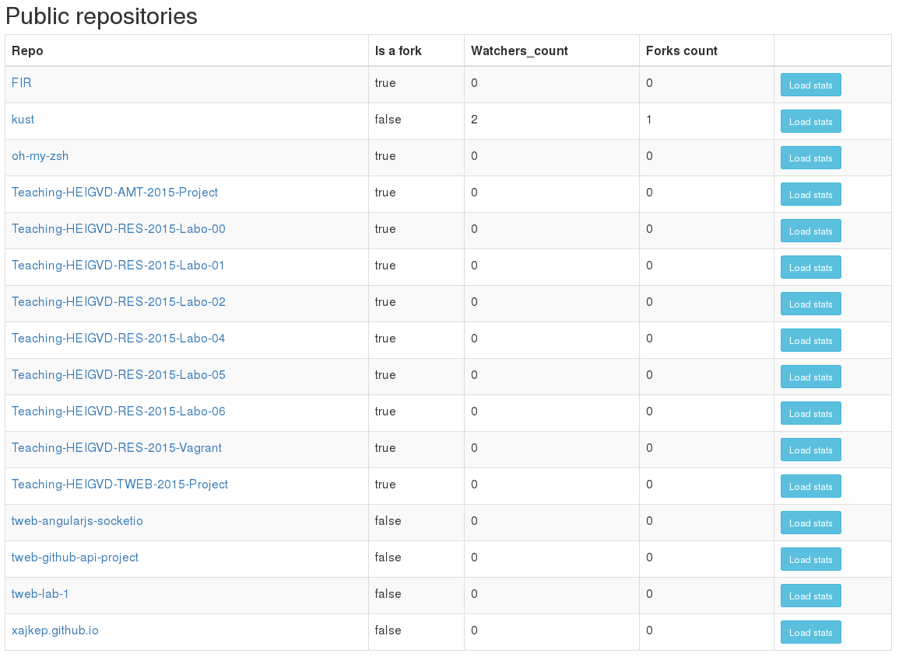

# TWEB - Github API Project

## Buts du projet

Mettre en place une application utilisant Angular et intéragissant avec l'API de Github.

## Fonctionnalités

* S'authentifier sur l'API de Github via OAuth
* Retrouver les informations personnelles d'un utilisateurs Github
* Retrouver les repos publiques de l'utilisateurs en question
* Afficher divers statistiques d'un repo avec ChartJS
  * Nombre d'ajouts et de suppressions par semaine (line chart)
  * Nombre de commit durant les dix dernières semaines (bar chart)
  * Activité des commits de la dernière semaine (bar chart)

## Technologies utilisées

* Node.js
* jQuery
* Twitter Bootstrap
* AngularJS
* ChartJS
* Express

## Mise en place

### Structure

* public (contenu destiné au client)
  * css (feuilles de style angular-chart et bootstrap)
  * ctrl (controlleur angular)
  * js (librairie angular, ChartJS et jQuery)
* main.js (code principal du serveur)
* index.html (vue principale)

### Node.js (server-side)

Node.js écoute sur le port 1337 et initialise Express qui permet de rendre le dossier *public* et son contenu accessible au client.

Node.js fournit également au client la page *index.html* qui est chargé lorsque la racine */* est atteinte.

### Angular, Chart.js, API calls (client-side)

Depuis la vue principale l'on peut entrer le nom d'utilisateur voulu, ici *xajkep*:

Ensuite deux premières requêtes sont effectuée auprès de l'API.

#### Récupération des données utilisateurs: GET /users/:username

*[Documentation](https://developer.github.com/v3/users/)*

Cette requête permet de retrouver l'url de l'avatar et les informations contenu dans le tableau de droite.

#### Récupération des repos publiques de l'utilisateur: GET /repos/:owner/:repo

*[Documentation](https://developer.github.com/v3/repos/#get)*

Cette requête permet de retrouver tous les repos publiques de l'utilisateur.

A noter que si le token d'authentification utilisé possédait les droits de lecture sur les repo privés, ceux-ci figureraient également dans ce tableau.

#### Chargement des statistiques d'un repo

*[Documentation](https://developer.github.com/v3/repos/statistics/)*

L'on peut charger les statistiques d'un repo en utilisant le bouton "Load stats". Les requêtes utilisées pour récupérer les statistiques du repo sont les suivante (dans l'ordre d'affichage des graphiques):
* GET /repos/:owner/:repo/stats/code_frequency
* GET /repos/:owner/:repo/stats/participation
* GET /repos/:owner/:repo/stats/commit_activity

Il a bien entendu été nécessaire de modifier les données reçues avant de les passer à Chart.js.

## Sources

* [Github API Documentation](https://developer.github.com/v3/)
